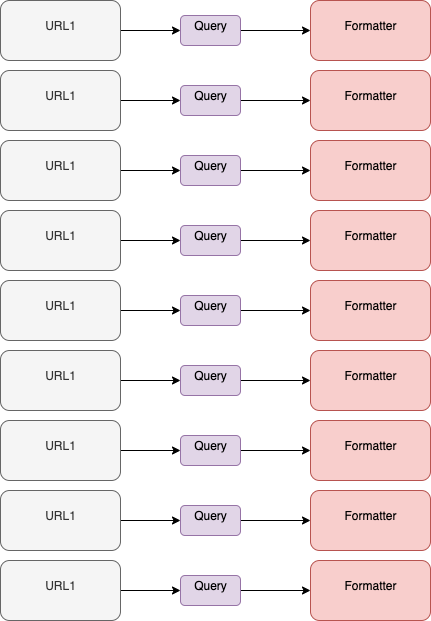
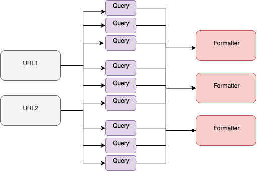

2019.11.08

- elasticsearch join

  https://www.elastic.co/guide/en/elasticsearch/reference/7.0/joining-queries.html

- Spring data elasticsearch

  - 보류

- Elasticsearch 반복되는 query 요청 구조 개선

  - 기존

    

  - 변경 후

    

    - ?? 객체지향이 아니다....

    - 생각하라, 객체지향 처럼

      http://woowabros.github.io/study/2016/07/07/think_object_oriented.html

      1. 객체를 생각하고, 객체를 타입으로 묶는다.
      2. 타입을 구성하고, 타입 사이의 관계를 정의함으로써 도메인을 설계한다.

      메시지를 먼저 선택하라?? 그리고 적절한 객체를 선택한다.

      > 오늘 코딩하면서 생각
      >
      > 추가/변화될 가능성이 파악된 구조에서는 공통적인 부분을 묶어 클래스로 만드는 것이 더 효율적이지 않을까하는 생각이 들었다. 객체지향적으로 객체의 책임과 협력에 대해서 설계를 하게 되면, 불필요한 로직이 많아지고, 복잡해진다. 객체지향 설계의 목적은 무엇인가??

      3. 도메인을 설계한 후, 각 객체간 주고 받을 메시지를 구체적으로 정의한다.
      4. 각 메시지를 인터페이스로 만든다.
      5. 구현한다.

    - 코드의 재사용

      - 상속 ( is - a )
      - Composition ( has - a )
      - Delegation - 책임을 참조객체의 메소드를 호출함으로써 완수 하는 것

      > 코드의 재사용시 상속을 사용하면 나중에 parent 가 바뀌었을때, 영향을 너무 많이 줄 수 있어서 피하라고 했다. 이 이유를 생각해보면
      >
      > child에서 parent 메소드를 그대로 실행만하면 상관없지만, parent의 데이터를 가져와 사용했다면 문제가 될 수 있다. 데이터의 key값이 바뀔수도 있고, 예전에 사용했는데 이제 안써서 지운 key값을 어느 누군가의 객체가 사용할 수 도 있기 때문이다. 
      >
      > 모든 의존성과 오류 사항을 파악할 수 있다면, 객체지향 or 절차지향 아무거나 써도된다. 하지만 객체지향은 **커지는 시스템에서 휴먼에러를 줄이기 위한 패러다임**이 아닐까 하는 생각이 든다.

      

